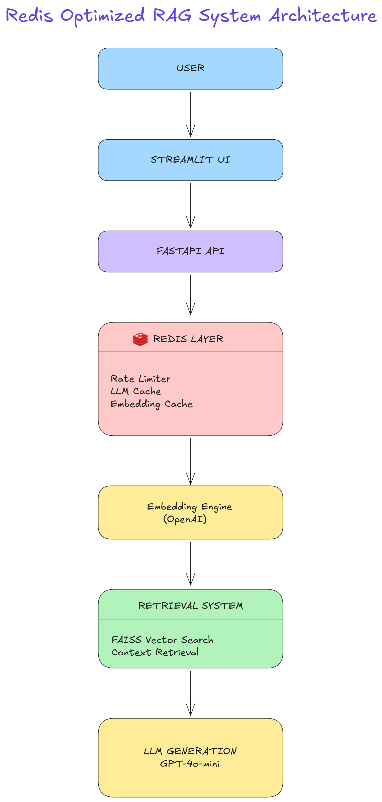

## System Architecture



```markdown
# Redis Optimized RAG AI System

A production-style Retrieval Augmented Generation (RAG) system built with Redis, FastAPI, semantic search, and OpenAI models.

This project demonstrates how Redis can be used to optimize AI systems by:

- caching LLM responses
- caching embeddings
- enforcing API rate limits
- tracking system metrics

The system retrieves relevant documents using vector similarity search and generates answers using **GPT-4o-mini**.

---

# Key Features

### Redis Intelligent Caching
Prevents repeated LLM calls by caching responses with TTL.

### Embedding Cache
Stores generated embeddings in Redis to reduce OpenAI API calls.

### API Rate Limiting
Protects the system from abuse using Redis atomic counters.

### Semantic Search
Uses embeddings and FAISS vector search to retrieve relevant documents.

### Retrieval Augmented Generation (RAG)
Combines document retrieval with LLM reasoning to produce grounded answers.

### Observability
Tracks cache hits, misses, and rate-limited requests using Redis counters.

### Streaming Responses
Supports token streaming from the LLM.

---

# System Architecture

```

User Question
↓
FastAPI API
↓
Redis Rate Limiter
↓
Redis LLM Cache
↓
Embedding Engine
↓
Redis Embedding Cache
↓
FAISS Vector Search
↓
Context Retrieval
↓
GPT-4o-mini
↓
Cache Response in Redis

```

---

# Redis Usage in This Project

This system demonstrates multiple real-world Redis patterns.

| Redis Feature | Implementation |
|------|------|
| LLM caching | Cache-aside pattern using SETEX |
| Embedding caching | Prevent repeated embedding API calls |
| Rate limiting | Atomic INCR + EXPIRE |
| Metrics tracking | Redis counters |
| TTL expiration | Automatic cache refresh |

---

# Tech Stack

### Backend
- Python 3.12
- FastAPI
- Redis

### AI
- OpenAI Embeddings
- GPT-4o-mini
- FAISS Vector Search

### Infrastructure
- Uvicorn
- python-dotenv

---

# Project Structure

```

redis-rag-ai-system
│
├── app
│   ├── main.py
│   ├── cache.py
│   ├── rate_limiter.py
│   ├── embeddings.py
│   ├── vector_search.py
│   ├── rag_pipeline.py
│   └── redis_client.py
│
├── data
│   └── documents.txt
│
├── requirements.txt
├── .env.example
└── README.md

```
---

# API Endpoints

## Health Check

```

GET /health

```

Checks system and Redis connectivity.

---

## Ask Question (RAG)

```

GET /ask?question=What is Redis?

````

Example Response:

```json
{
  "source": "llm",
  "remaining_requests": 4,
  "data": {
    "answer": "Redis is an in-memory data structure store used as a database, cache, and message broker."
  }
}
````

---

## Streaming Response

```
GET /stream?question=What is Redis?
```

Streams tokens from the LLM.

---

## Metrics

```
GET /metrics
```

Example response:

```json
{
  "cache_hits": 10,
  "cache_misses": 3,
  "embedding_cache_hits": 25,
  "embedding_cache_misses": 5,
  "rate_limited_requests": 2
}
```

---

# Running the Project

## 1. Install dependencies

```
pip install -r requirements.txt
```

## 2. Add environment variables

Create `.env`

```
OPENAI_API_KEY=your_openai_api_key
```

---

## 3. Start Redis

```
redis-server
```

---

## 4. Run the API

```
uvicorn app.main:app --reload
```

Open API docs:

```
http://127.0.0.1:8000/docs
```

---

# Example Query

```
GET /ask?question=What is Redis?
```

The system will:

1. check Redis cache
2. enforce rate limiting
3. perform semantic search
4. retrieve relevant documents
5. generate answer using GPT-4o-mini
6. store result in Redis cache

---

# Why This Project Matters

This project demonstrates how Redis can significantly improve AI system performance by:

* reducing repeated LLM calls
* reducing embedding API calls
* protecting APIs with rate limiting
* improving response latency

These patterns are commonly used in modern **AI infrastructure and backend systems**.

---

# Future Improvements

Possible enhancements:

* Redis Vector Search instead of FAISS
* Dockerized deployment
* Web UI for interactive queries
* Distributed Redis cluster support
* Streaming RAG responses
